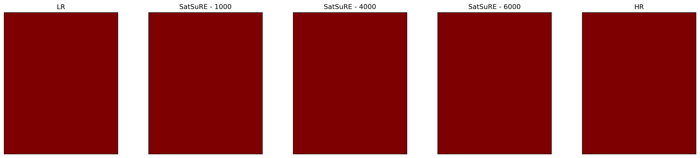
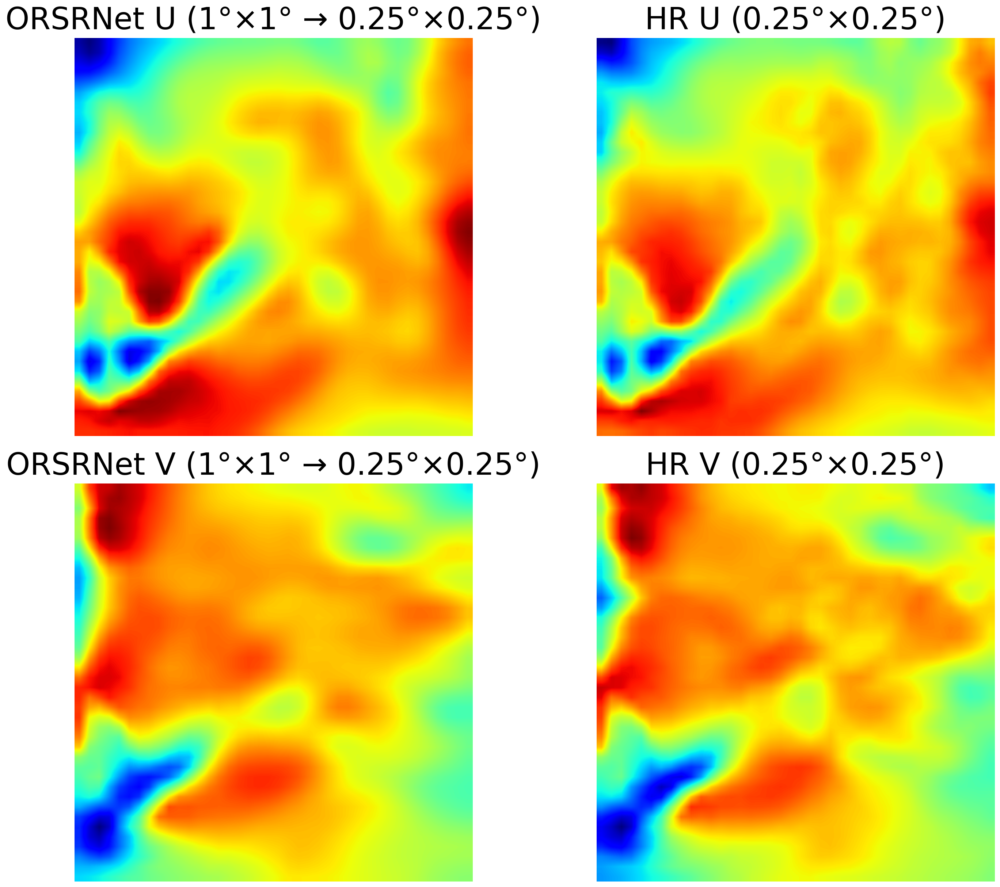
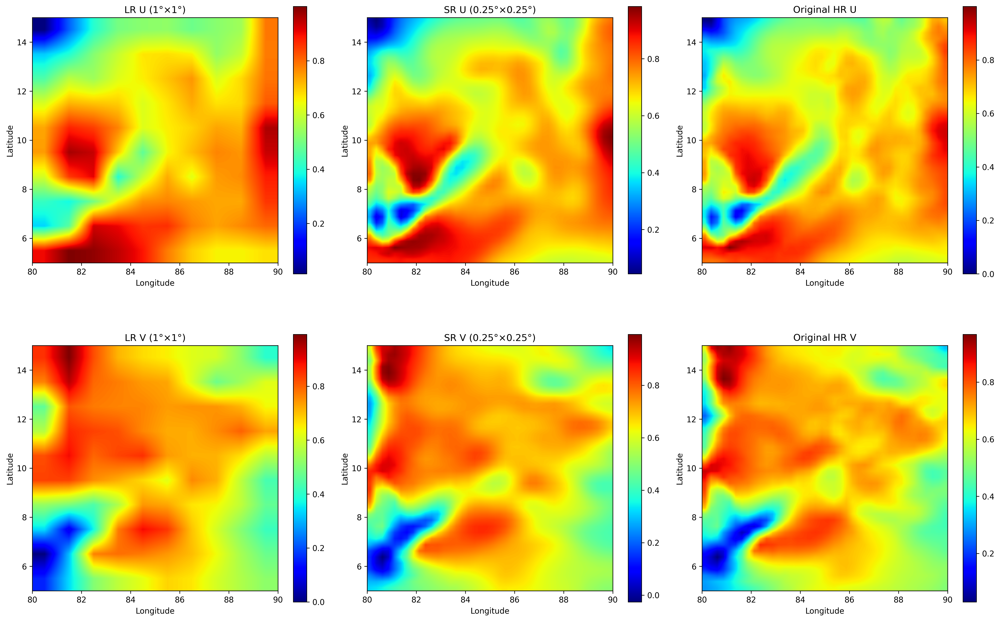
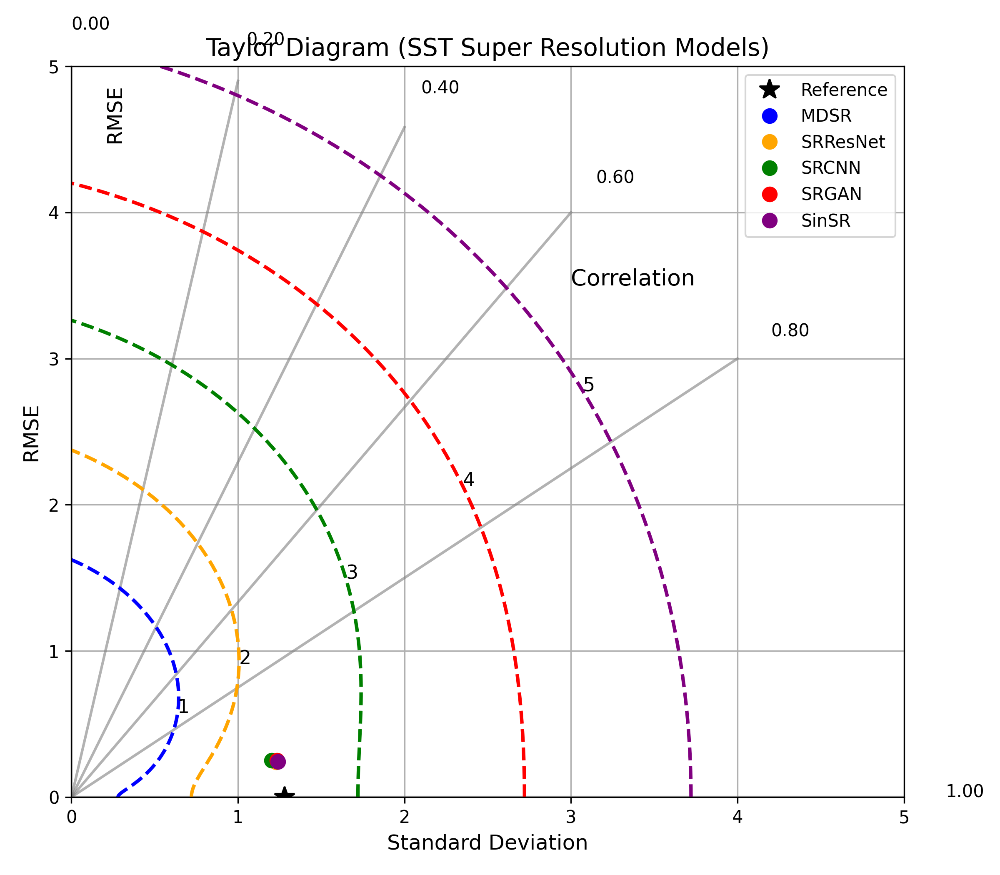
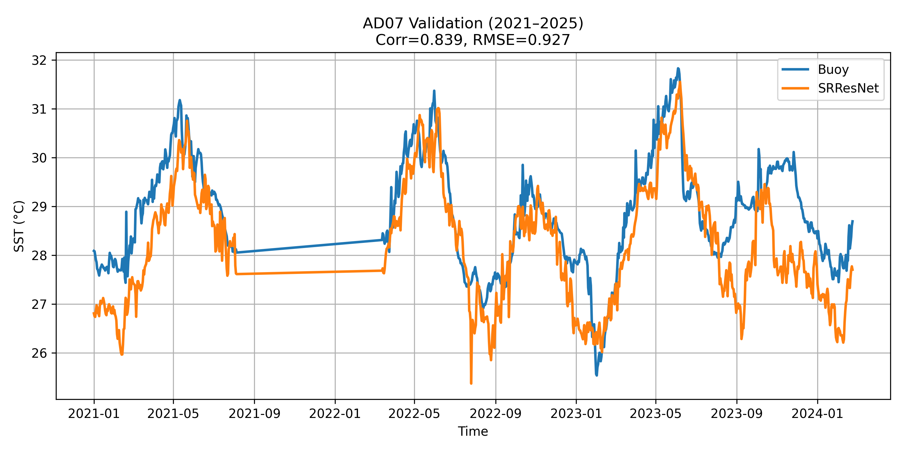

# Satellite Super-Resolution (SatSuRE) for Oceanography


Welcome to the **Satellite Super-Resolution** repository. This project focuses on super-resolving Sea Surface Temperature (SST) and Wind velocity fields from low-resolution datasets (e.g., 1-degree resolution) to high-resolution grids. The project features **SatSuRE (Satellite Super-Resolution)** as the primary model architecture, along with evaluations and comparisons against other state-of-the-art super-resolution architectures: MDSR, RealESRGAN, SinSR, SRCNN, and SRGAN.


---

## Table of Contents
1. [Overview & Objectives](#overview--objectives)
2. [Model Architectures](#model-architectures)
3. [Repository File Structure](#repository-file-structure)
4. [Installation & Requirements](#installation--requirements)
5. [Training & Execution Guide](#training--execution-guide)
6. [Results & Visual Comparisons](#results--visual-comparisons)
7. [License](#license)

---

## Overview & Objectives
High-resolution satellite observations are crucial for climate studies, weather forecasting, and oceanographic analysis. However, raw satellite measurements or numerical models often produce coarse-grid data. 

This repository provides scripts to:
- Upsample **Sea Surface Temperature (SST)** fields by **4x** spatial resolution.
- Upsample **Wind velocity fields (U and V components)** to reconstruct detailed wind vectors.
- Compare different deep learning models across metrics like PSNR, SSIM, and mean bias.
- Deploy trained models for downscaling and spatial interpolation tasks.

---

## Model Architectures

### 1. SatSuRE (Satellite Super-Resolution)
**SatSuRE** is our customized flagship architecture (derived from SRResNet) designed to preserve spatial coherence and fine details in continuous geophysical field distributions.
- **Backbone**: 16 deep residual blocks.
- **Layers**: Convolutional layers with PReLU activations and Batch Normalization.
- **Upscaling**: Sub-pixel convolutional layers (using `nn.PixelShuffle`) to upsample 4x smoothly without checkerboard artifacts.

### 2. MDSR (Multi-scale Deep Super-Resolution)
An efficient architecture that shares parameters across multiple scale factors. In this project, MDSR is trained specifically on multi-scale SST and Wind datasets, optimizing parameters through scaled residual connections.

### 3. RealESRGAN
An enhanced version of ESRGAN that incorporates realistic degradation models, utilizing a U-Net-based discriminator and spectral normalization to produce sharp, realistic boundaries.

### 4. SinSR
A single-image super-resolution model tailored for specific spatial scale patterns, using specialized losses to recover localized high-frequency fluctuations.

### 5. SRCNN
The classic Super-Resolution Convolutional Neural Network consisting of three layers (patch extraction, non-linear mapping, reconstruction) acting as a foundational baseline.

### 6. SRGAN (super-Resolution Generative Adversarial Network )
A Generative Adversarial Network incorporating SatSuRE as its generator and a truncated VGG-19 network for calculating perceptual loss alongside adversarial training.

---

## Repository File Structure

The project is structured into two main tracks: Sea Surface Temperature (SST) and Wind Velocity fields.

```
super-resolution/
├── LICENSE                          # MIT License
├── README.md                         # Project documentation
├── requirements.txt                  # Python dependencies
├── satsure/                          # Result and validation plots
│   ├── satsure_clean_comparison_6000.png
│   ├── satsure_uv_comparison_6000.png
│   ├── 2020-06-06_SatSuRE_all.png
│   ├── FINAL_VALIDATION.png
│   ├── buoy_validation.png
│   └── ... (other result comparison plots)
│
├── train_1deg_satsure_res.py        # SatSuRE model training (SST)
├── train_1deg_sst.py                # MDSR model training (SST)
├── train_1deg_realesrgan_res.py     # RealESRGAN model training (SST)
├── train_1deg_sinsr.py              # SinSR model training (SST)
├── train_1deg_srcnn_res.py          # SRCNN model training (SST)
├── train_1deg_srgan_res.py          # SRGAN model training (SST)
│
├── eval_1deg_satsure.py             # SatSuRE model evaluation (SST)
├── eval_1deg_mdsr.py                # MDSR model evaluation (SST)
├── eval_1deg_realesrgan.py          # RealESRGAN model evaluation (SST)
├── eval_1deg_sinsr.py               # SinSR model evaluation (SST)
├── eval_1deg_srcnn.py               # SRCNN model evaluation (SST)
├── eval_1deg_srgan.py               # SRGAN model evaluation (SST)
│
├── infer_1deg_satsure.py            # SatSuRE model inference (SST)
├── infer_1deg_mdsr.py               # MDSR model inference (SST)
├── infer_1deg_sinsr.py              # SinSR model inference (SST)
├── infer_1deg_srcnn.py              # SRCNN model inference (SST)
├── infer_1deg_srgan.py              # SRGAN model inference (SST)
│
└── wind/
    └── wind/
        ├── train_satsure_res.py     # SatSuRE model training (Wind)
        ├── train_mdsr_resume.py     # MDSR model training (Wind)
        ├── train_realesrgan_res.py  # RealESRGAN model training (Wind)
        ├── train_sinsr.py           # SinSR model training (Wind)
        ├── train_srcnn.py           # SRCNN model training (Wind)
        ├── train_srgan_res.py       # SRGAN model training (Wind)
        │
        ├── eval_satsure_res.py      # SatSuRE model evaluation (Wind)
        ├── eval_realesrgan.py       # RealESRGAN model evaluation (Wind)
        ├── eval_sinsr.py            # SinSR model evaluation (Wind)
        ├── eval_srcnn.py            # SRCNN model evaluation (Wind)
        ├── eval_srgan_res.py        # SRGAN model evaluation (Wind)
        │
        ├── satsure__infer.py        # SatSuRE model inference (Wind)
        ├── mdsr_infer.py            # MDSR model inference (Wind)
        ├── sinsr_infer.py           # SinSR model inference (Wind)
        ├── srcnn_infer.py           # SRCNN model inference (Wind)
        └── srgan_infer.py           # SRGAN model inference (Wind)
```

---

## Installation & Requirements

### Dependencies
Install the required packages using pip:
```bash
pip install -r requirements.txt
```

### Typical requirements include:
- `torch>=1.10.0`
- `numpy>=1.20.0`
- `matplotlib>=3.4.0`
- `scikit-image>=0.18.0`
- `netCDF4>=1.5.0`

---

## Training & Execution Guide

### 1. Training SST Models
For training SST models, use the `train_1deg_*.py` scripts. For example, to train the flagship **SatSuRE** model using PyTorch Distributed Data Parallel (DDP):
```bash
python -m torch.distributed.run --nproc_per_node=NUM_GPUS train_1deg_satsure_res.py
```

### 2. Evaluating SST Models
To run evaluation on the validation sets and compute PSNR, SSIM, and generate spatial error plots:
```bash
python eval_1deg_satsure.py
```

### 3. Inference
To produce super-resolved SST outputs for a specific date:
```bash
python infer_1deg_satsure.py
```

### 4. Running Wind Scripts
For wind scripts, navigate to the `wind/wind/` directory:
```bash
cd wind/wind/
python train_satsure_res.py
python eval_satsure_res.py
python satsure__infer.py
```

---

## Results & Visual Comparisons

The performance and fidelity of the models have been validated using spatial cross-sections, timeseries analyses, and buoy observations. Below are visual demonstrations of the results:

### 1. SatSuRE SST Reconstruction and Residuals
SatSuRE performs high-fidelity reconstruction, capturing coastal temperature gradients and currents.


### 2. SatSuRE Clean vs. Wind UV Comparisons
Comparison of target high-resolution fields versus super-resolved predictions at epoch 6000:
- **Clean SST Comparison**:
  
- **Wind UV Vector Comparison**:
  

### 3. Comprehensive Model Validation & Taylor Diagram
Evaluating the models against reference buoy measurements reveals high correlation and minimal spatial bias:
- **Taylor Diagram Comparison**:
  
- **Buoy Validation Timeseries**:
  
- **Overall Model Alignment**:
  

---

## License

This project is licensed under the MIT License - see the [LICENSE](LICENSE) file for details.
